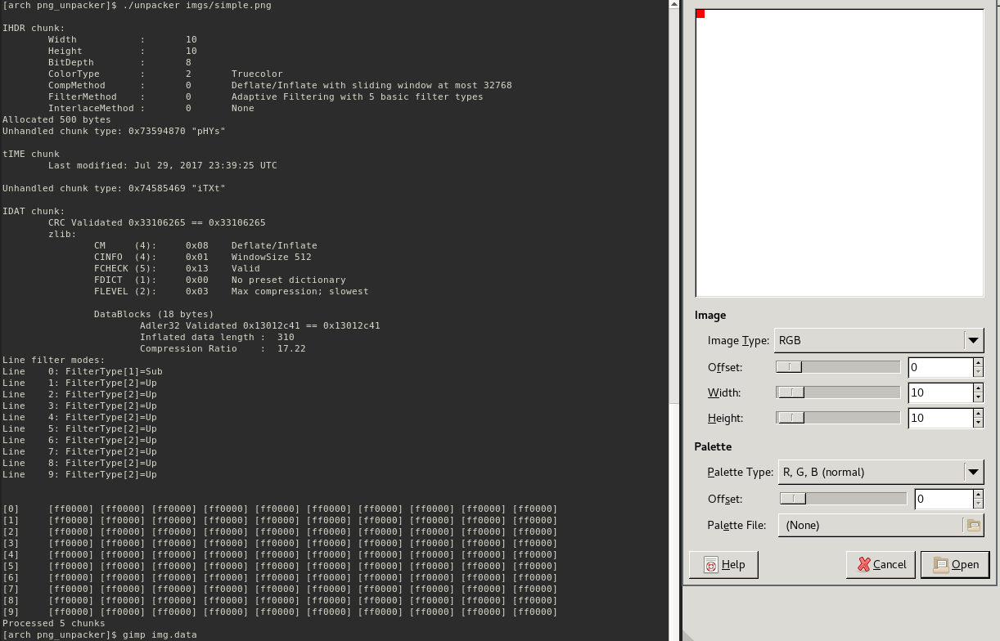

# PNG Unpacker
This is a _very_ simple/brittle PNG decoder that was briefly implemented to support an academic final project. It is likely to fail
in most general cases and should not be depended on for any reason.

 * Only tested on x86
 * Fails to decode images with more than one IDAT chunk
 * Build with `make` (requires zlib)
 * Only a few ancillary chunks are handled
 * Add a new entry to [g_chunk_handlers](https://github.com/sherrellbc/png_unpacker/blob/master/png_unpacker.c#L689) to support new chunk types

Below is a simple example of the expected output (though the final decoded prints are commented out by default). This case is _very_ simple; the decoder can decode all images contained in [imgs](imgs/).

